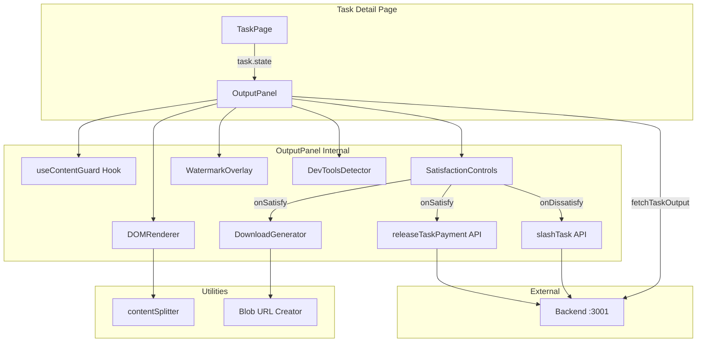

# Design Document: Output Content Protection

## Overview

Output Content Protection provides a client-side defense layer that prevents extraction of agent-generated task output before the client confirms satisfaction and triggers payment release. The feature integrates into the existing task view flow—rendering a protected `OutputPanel` when a task reaches SUBMITTED state, applying CSS/JS copy prevention, screenshot deterrence (watermarks, visibility-based overlays), DOM obfuscation with decoy characters, and DevTools detection. Upon satisfaction, protections are removed and a downloadable Markdown file is generated. Upon dissatisfaction, protections persist while the refund flow completes and content is purged from the DOM.

### Key Design Decisions

| Decision | Rationale |
|----------|-----------|
| Custom `useContentGuard` hook (not Zustand) | Protection state is scoped to a single component instance; global store adds unnecessary coupling |
| Blob URL + `<a download>` for file delivery | No server round-trip needed; content already in memory after unlock |
| DOM splitting with decoy `<span>` elements | Raises cost of `textContent` scraping while remaining accessible via `aria-hidden` |
| `visibilitychange` API for tab-switch overlay | Standard, cross-browser event; fires within ~50ms |
| DevTools detection via `debugger` + resize heuristic | No perfect detection exists; these two signals together cover 90%+ of desktop browsers |

---

## Architecture



### Data Flow

1. **Task page** fetches task metadata via `fetchTask(taskId)`. If `task.state === SUBMITTED`, `OutputPanel` mounts.
2. `OutputPanel` fetches the raw task output from the backend (`GET /api/tasks/:taskId/output`).
3. `useContentGuard` attaches event listeners (copy, contextmenu, dragstart, selectstart) and applies CSS protections.
4. `DOMRenderer` splits markdown-rendered HTML into non-contiguous segments with interleaved decoy characters.
5. `WatermarkOverlay` renders a tiled SVG watermark with client address + timestamp.
6. `DevToolsDetector` monitors for DevTools open state via resize heuristic + `debugger` timing.
7. On `visibilitychange → hidden`, a full-screen opaque overlay is shown within 100ms.
8. **Satisfaction path**: Protections removed → `DownloadGenerator` builds Blob → triggers `<a download>` click → calls `releaseTaskPayment`.
9. **Dissatisfaction path**: Calls `slashTask` → on success, content is removed from DOM while protections stay active.

---

## Components and Interfaces

### Component Tree

```
TaskDetailPage (src/app/tasks/[id]/page.tsx)
└── OutputPanel (src/components/output/OutputPanel.tsx)
    ├── ProtectionBanner
    ├── WatermarkOverlay
    ├── ProtectedContent (DOMRenderer)
    │   └── ContentSegment[] (split DOM nodes with decoys)
    ├── DevToolsOverlay
    ├── VisibilityOverlay
    └── SatisfactionControls
        ├── SatisfyButton
        └── DissatisfyButton
```

### OutputPanel

```typescript
// src/components/output/OutputPanel.tsx
interface OutputPanelProps {
  task: Task;
  clientAddress: string;
}

// Renders based on task.state:
// - CREATED | LOCKED → null (not rendered)
// - SUBMITTED → Protected view with controls
// - SETTLED → Unlocked view with re-download
// - SLASHED → Refunded message
```

### useContentGuard Hook

```typescript
// src/hooks/useContentGuard.ts
interface ContentGuardState {
  isProtected: boolean;
  isInitialized: boolean;
  error: string | null;
}

interface UseContentGuardReturn {
  state: ContentGuardState;
  containerRef: React.RefObject<HTMLDivElement>;
  unlock: () => void;
}

function useContentGuard(enabled: boolean): UseContentGuardReturn;
```

**Responsibilities:**
- Attaches/detaches event listeners for `copy`, `cut`, `paste`, `contextmenu`, `dragstart`, `selectstart`
- Sets `user-select: none` on the container via inline style
- Provides `unlock()` to remove all protections
- Reports `isInitialized: false` if listener attachment fails (triggers content withholding per Req 2.6)

### DownloadGenerator

```typescript
// src/lib/utils/downloadGenerator.ts
interface DownloadOptions {
  taskId: string;
  taskTitle: string;
  content: string;
  lane: LaneType;
  agentAddress: string;
  completionDate: string; // ISO 8601
}

function generateMarkdownFile(options: DownloadOptions): Blob | null;
function triggerDownload(blob: Blob, filename: string): void;
function buildFilename(taskId: string, taskTitle: string): string;
```

**Responsibilities:**
- Builds YAML frontmatter with metadata
- Preserves original markdown content
- Enforces 10MB max file size
- Generates kebab-case filename truncated to 80 chars
- Returns `null` if content is empty/unavailable

### contentSplitter

```typescript
// src/lib/utils/contentSplitter.ts
interface SplitResult {
  segments: string[];      // HTML segments (min 3 per block)
  decoyPositions: number[]; // indices where decoys are inserted
}

function splitContent(html: string): SplitResult;
function insertDecoys(segment: string, ratio: number): string;
```

**Responsibilities:**
- Splits rendered HTML into ≥3 non-contiguous DOM segments per output block
- Inserts invisible decoy characters (zero-width spaces, joiners) at 1 per 50 visible characters
- Wraps decoys in `<span aria-hidden="true" style="font-size:0;position:absolute">` to hide from screen readers and display

### DevToolsDetector

```typescript
// src/components/output/DevToolsDetector.tsx
interface DevToolsDetectorProps {
  onOpen: () => void;
  onClose: () => void;
}
```

**Detection strategy:**
1. **Resize heuristic**: Monitors `window.outerWidth - window.innerWidth > 160` or equivalent height delta
2. **Debugger timing**: Periodically measures time to execute a `debugger` statement (>100ms = DevTools open with breakpoints)
3. Fires `onOpen`/`onClose` callbacks; OutputPanel shows/hides the warning overlay

### WatermarkOverlay

```typescript
// src/components/output/WatermarkOverlay.tsx
interface WatermarkOverlayProps {
  clientAddress: string; // full address, component truncates to first 6 + last 4
  timestamp: string;     // ISO 8601
}
```

Renders a full-coverage `<div>` with:
- `pointer-events: none` so it doesn't block interaction with underlying content
- Tiled SVG pattern at 15–25% opacity
- Text: `{addr6}...{addr4}` + timestamp, rotated 45°

---

## Data Models

### Task Output API Response

```typescript
// GET /api/tasks/:taskId/output
interface TaskOutputResponse {
  taskId: string;
  content: string;      // Raw markdown content
  submittedAt: string;  // ISO 8601
  agentAddress: string;
}
```

### Protection State (local to OutputPanel)

```typescript
interface OutputPanelState {
  output: string | null;          // raw markdown
  isLoading: boolean;
  error: string | null;
  isProtected: boolean;           // true when Content_Guard active
  isSatisfying: boolean;          // loading state for satisfy action
  isDissatisfying: boolean;       // loading state for dissatisfy action
  isDevToolsOpen: boolean;
  isTabHidden: boolean;
  downloadBlob: Blob | null;
}
```

### Download File Structure

```yaml
---
title: "Task Title Here"
taskId: "abc123"
lane: "CODE"
agent: "AGENT_ADDRESS"
completedAt: "2024-01-15T10:30:00Z"
---

# Task Title Here

[Original Task_Output content preserved as-is]
```

### Type Extensions

```typescript
// Addition to src/lib/types.ts
export interface TaskOutput {
  taskId: string;
  content: string;
  submittedAt: string;
  agentAddress: string;
}
```

### API Integration Points

| Endpoint | Method | Existing? | Purpose |
|----------|--------|-----------|---------|
| `/api/tasks/:taskId` | GET | ✅ Yes | Fetch task state/metadata |
| `/api/tasks/:taskId/output` | GET | ❌ New | Fetch raw task output content |
| `/api/tasks/:taskId/release` | POST | ✅ Yes | Release escrowed payment |
| `/api/tasks/:taskId/slash` | POST | ✅ Yes | Slash agent and trigger refund |


---

## Correctness Properties

*A property is a characteristic or behavior that should hold true across all valid executions of a system—essentially, a formal statement about what the system should do. Properties serve as the bridge between human-readable specifications and machine-verifiable correctness guarantees.*

### Property 1: Markdown rendering preserves structural elements

*For any* valid markdown string containing headings, lists, code blocks, or inline formatting, rendering through the OutputPanel's markdown pipeline SHALL produce HTML that contains the corresponding semantic elements (h1–h6, ul/ol/li, pre/code, em/strong) with no content truncation.

**Validates: Requirements 1.2**

### Property 2: Watermark displays correctly truncated address and timestamp

*For any* valid Algorand address (58 characters) and any ISO 8601 timestamp, the WatermarkOverlay SHALL render text containing exactly the first 6 characters and last 4 characters of the address separated by an ellipsis, and a timestamp matching ISO 8601 format (YYYY-MM-DDThh:mm:ssZ).

**Validates: Requirements 3.2**

### Property 3: Filename generation produces valid kebab-case output

*For any* non-empty task title string and task ID, the `buildFilename` function SHALL produce a filename that: (a) contains only lowercase alphanumeric characters, hyphens, and ends with `.md`; (b) is at most 80 characters in length; (c) incorporates the task ID; and (d) is deterministic (same inputs always produce same output).

**Validates: Requirements 4.3, 6.2**

### Property 4: Generated markdown file is valid CommonMark

*For any* non-empty task output string and valid metadata (lane, agent address, ISO date), the `generateMarkdownFile` function SHALL produce a UTF-8 encoded file whose content (after YAML frontmatter) is parseable by a CommonMark-compliant parser without errors and whose total size does not exceed 10 MB.

**Validates: Requirements 6.1**

### Property 5: YAML frontmatter contains all required metadata fields

*For any* valid combination of task title, task ID, lane type, agent address, and completion date, the generated file SHALL begin with a YAML frontmatter block (delimited by `---` lines) containing all five fields with values matching the inputs.

**Validates: Requirements 6.3**

### Property 6: Content preservation round-trip

*For any* non-empty markdown string used as Task_Output, the content section of the generated download file (everything after the frontmatter and h1 heading) SHALL be character-for-character identical to the original input.

**Validates: Requirements 6.4**

### Property 7: DOM splitting produces accessible decoy-laden segments

*For any* non-empty HTML string, the `splitContent` function SHALL produce: (a) at least 3 non-contiguous DOM segments; (b) at least 1 invisible decoy character per 50 visible characters; (c) a combined `textContent` containing at least 10% non-visible decoy characters relative to visible character count; and (d) all decoy elements marked with `aria-hidden="true"` and rendered at zero visible width.

**Validates: Requirements 8.2, 8.4**

---

## Error Handling

### Content Loading Failures

| Scenario | Behavior |
|----------|----------|
| Network error fetching task output | Display "Output unavailable" message; do not enter Protected_View (Req 1.6) |
| Empty output string from API | Same as above |
| Task output exceeds 10MB | Truncate at 10MB boundary for display; mark download as unavailable |

### Protection Initialization Failures

| Scenario | Behavior |
|----------|----------|
| Event listeners fail to attach | Set `isInitialized: false`; withhold content rendering (Req 2.6) |
| CSS injection blocked | Fall back to inline styles on container |
| DevTools detection unavailable | Silently degrade; skip DevTools overlay feature |

### Payment/Refund API Failures

| Scenario | Behavior |
|----------|----------|
| `releaseTaskPayment` returns error | Show error toast; re-enable Satisfaction_Button; keep download file available (Req 4.6) |
| `slashTask` returns error | Show error toast; re-enable both buttons (Req 5.6) |
| `slashTask` times out (30s) | Same as error case |
| No wallet connected on action | Show wallet connection prompt; block action (Req 4.7) |

### File Generation Failures

| Scenario | Behavior |
|----------|----------|
| Content empty/null at generation time | Return `null`; display error message (Req 6.5) |
| Blob creation fails (memory) | Show error toast; suggest refreshing page |
| Download trigger fails | Provide fallback "Copy to clipboard" option |

---

## Testing Strategy

### Testing Framework

- **Unit/Integration**: Vitest + React Testing Library (already configured in project)
- **Property-based testing**: `fast-check` library with Vitest integration
- **Environment**: jsdom (configured in vitest.config.ts)

### Property-Based Tests

Property-based testing is appropriate for this feature because:
- The `DownloadGenerator` and `contentSplitter` are pure functions with clear input/output behavior
- Universal properties (round-trip content preservation, filename validity, decoy ratios) hold across wide input spaces
- The input space (markdown strings, addresses, titles) is large/infinite

**Configuration:**
- Minimum 100 iterations per property test
- Each test tagged with: `Feature: output-content-protection, Property {N}: {title}`

**PBT Library**: `fast-check` (TypeScript-native, integrates with Vitest, excellent string/structured-data generators)

| Property | Test File | Generators |
|----------|-----------|------------|
| P1: Markdown preservation | `tests/output/markdownRendering.property.test.ts` | `fc.string()` with markdown-like patterns |
| P2: Watermark truncation | `tests/output/watermark.property.test.ts` | `fc.string({ minLength: 58, maxLength: 58 })`, `fc.date()` |
| P3: Filename generation | `tests/output/downloadGenerator.property.test.ts` | `fc.string({ minLength: 1, maxLength: 200 })` |
| P4: CommonMark validity | `tests/output/downloadGenerator.property.test.ts` | `fc.string()` with markdown patterns |
| P5: Frontmatter completeness | `tests/output/downloadGenerator.property.test.ts` | `fc.record(...)` with metadata fields |
| P6: Content round-trip | `tests/output/downloadGenerator.property.test.ts` | `fc.string({ minLength: 1 })` |
| P7: DOM splitting | `tests/output/contentSplitter.property.test.ts` | `fc.string({ minLength: 50 })` |

### Unit Tests (Example-Based)

| Area | Scenarios |
|------|-----------|
| OutputPanel rendering | State-based visibility (CREATED→null, SUBMITTED→protected, SETTLED→unlocked, SLASHED→message) |
| useContentGuard | Event listener attachment, unlock transition, initialization failure |
| SatisfactionControls | Button disable on click, API call triggers, error re-enable |
| DissatisfactionControls | Button disable, API call, timeout handling, content removal |
| WatermarkOverlay | Correct opacity range, rotation, pointer-events:none |
| DevToolsDetector | Resize threshold triggers, overlay show/hide |
| VisibilityOverlay | visibilitychange events trigger overlay |

### Integration Tests

| Scenario | Approach |
|----------|----------|
| Full satisfaction flow | Mock API; verify protection → unlock → download → API call sequence |
| Full dissatisfaction flow | Mock API; verify protection maintained → API call → DOM cleanup |
| State transitions | Verify component behavior across all TaskState values |

### Edge Case Coverage

- Empty task output
- Task output with only whitespace
- Extremely long task titles (>200 chars)
- Unicode/emoji in task titles and content
- Wallet disconnection mid-flow
- API timeout scenarios
- Content_Guard attachment failure simulation
